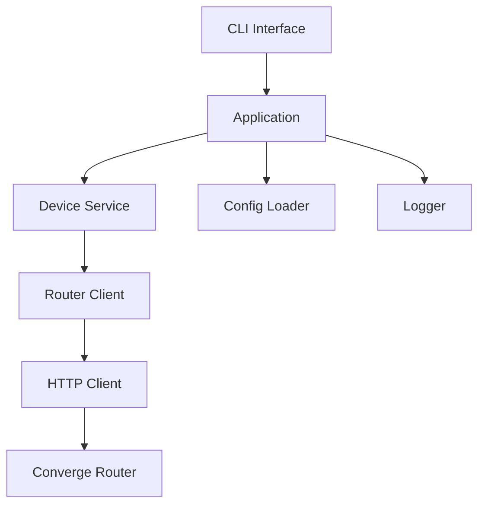

# Converge WiFi Manager

A cross-platform C++23 CLI for managing an owned or authorized Converge ZTE F670L router.

This repository is currently at the v0.5 stage: the project builds, the CLI menu exists, and the core router endpoints (login, device listing, block, and unblock) for the ZTE F670L have been implemented based on community research. Unit tests and CI pipelines are active.

## Current Features

- CMake C++23 project setup
- CLI menu matching the project spec
- Application, service, router-client, model, and utility layers
- Config loading from `config/config.json`
- Basic console logger
- Real WinHTTP-based HTTP client (Windows, no dependencies) and LibCurl support (Linux/Termux)
- ZTE F670L router adapter with protocol implementation based on community research
- GoogleTest Unit testing suite
- Automated GitHub Actions CI pipeline
- No hardcoded passwords

## Architecture



The CLI must not call networking directly. Router behavior belongs behind `IRouterClient`, with one implementation per supported router family.

## Build

Windows:

```powershell
cmake -B build
cmake --build build
```

Linux:

```bash
cmake -B build
cmake --build build
```

Termux:

```bash
pkg update
pkg install clang cmake git make
cmake -B build
cmake --build build
```

## Run

Windows:

```powershell
.\build\Debug\converge-wifi-manager.exe
```

MinGW single-config builds may output here instead:

```powershell
.\build\converge-wifi-manager.exe
```

Linux or Termux:

```bash
./build/converge-wifi-manager
```

## Configuration

Edit `config/config.json`:

```json
{
  "router_ip": "192.168.1.1",
  "username": "admin",
  "refresh_interval": 30,
  "auto_login": false
}
```

Passwords are requested interactively and are not stored by default.

## Roadmap

- v0.1: Project setup and CLI scaffold
- v0.5: Real HTTP transport and ZTE F670L interaction logic (login, list, block)
- v1.0: Polish, tests, and stable CLI

## Security

Use this only on routers you own or are authorized to administer. Do not add block/unblock or login endpoints by guessing undocumented behavior; capture and confirm router requests first.
