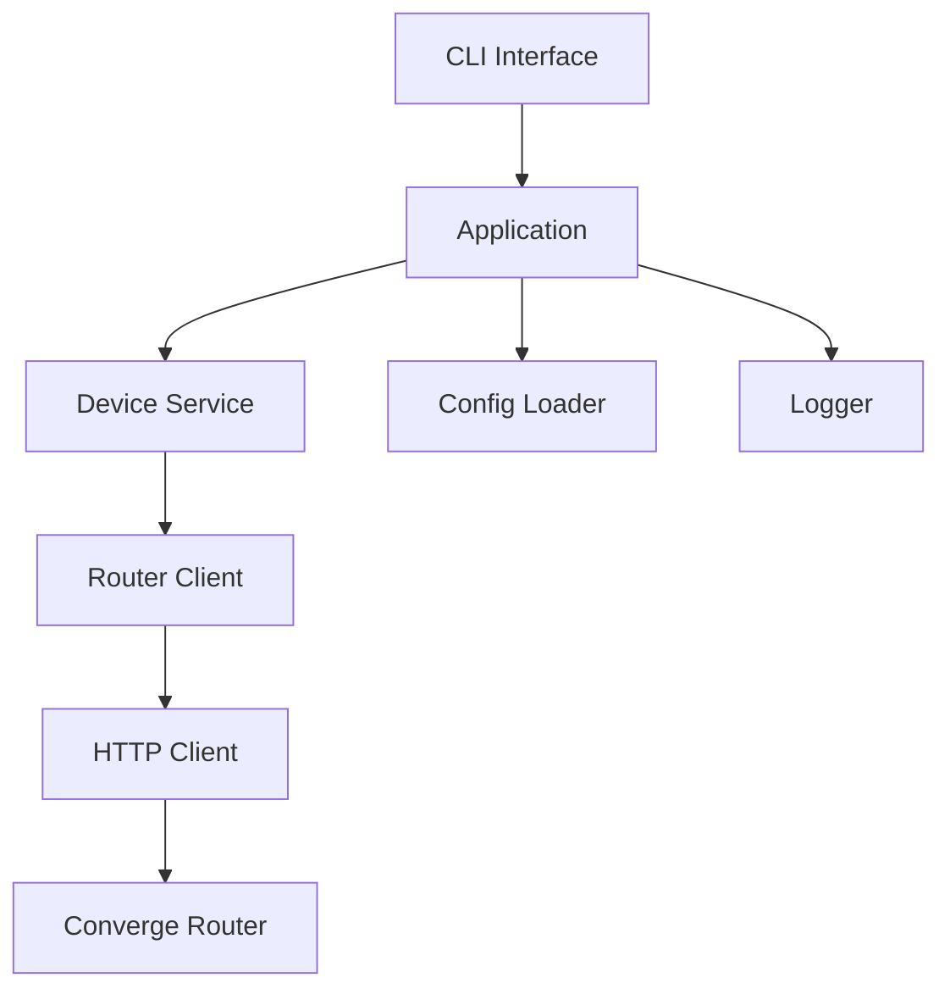

# System Architecture

The Converge WiFi CLI Device Manager is built using a strict layered architecture to ensure separation of concerns and maintainability.

## High-Level Component Diagram

## Layer Definitions

### 1. CLI Layer
The entry point of the application. It handles user input, routes commands, and formats the output for the console. It knows nothing about networking or routers.

### 2. Application Layer
Orchestrates the core business logic by coordinating the Services, Configuration, and the CLI.

### 3. Service Layer (`DeviceService`)
Contains the application's domain logic. For example, it caches devices, performs searches, and aggregates data from the router client.

### 4. Router Client Layer (`IRouterClient`)
An abstraction over the specific router model. It translates high-level domain operations (like "block device") into the specific HTTP requests required by that exact router model (e.g., `ZteF670LRouterClient`).

### 5. HTTP Client Layer (`IHttpClient`)
An abstraction over the operating system's networking capabilities. It allows the application to use native APIs on Windows (`WinHttpClient`) and libcurl on Linux/Termux (`CurlHttpClient`) without changing the router logic.

## Future Plans (v0.7)
As the project grows, the `Router Client` layer will be refactored into a Plugin Architecture. This will allow new router models to be supported simply by dropping a new compiled plugin into a specific folder, without modifying the core CLI application.
